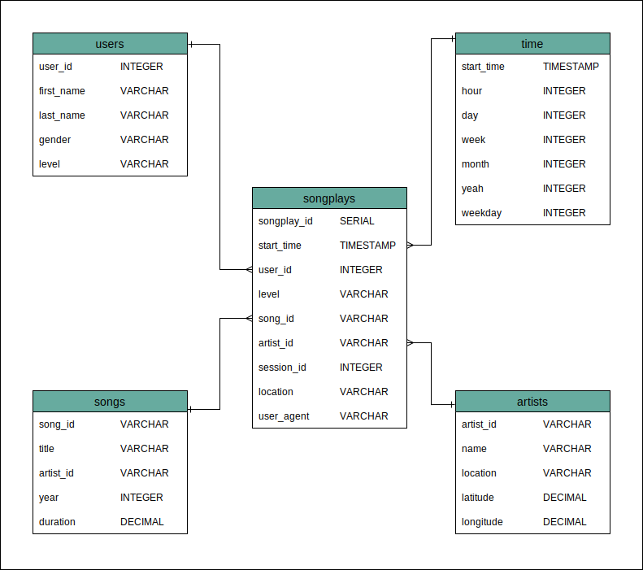

# Data Modeling with Postgres

## Introduction

The analytics team at a (fictional) music streaming startup named Sparkify wants to get a better understanding of what songs users are listening to. The goal is to help them organize the data, which currently resides in JSON files, into a Postgres database so that it can easily be queried.

This project therefore tackles the data modeling and ETL pipeline creation process that will transform, with the use of Python, this JSON data into clean Postgres tables.

This project is part of the Udacity Data Engineering nanodegree.

## Database Schema

### Fact Table

**songplays** - records in log data associated with song plays i.e. records with page NextSong
- songplay_id, start_time, user_id, level, song_id, artist_id, session_id, location, user_agent

### Dimension Tables

**users** - users in the app
- user_id, first_name, last_name, gender, level

**songs** - songs in music database
- song_id, title, artist_id, year, duration

**artists** - artists in music database
- artist_id, name, location, latitude, longitude

**time** - timestamps of records in songplays broken down into specific units
- start_time, hour, day, week, month, year, weekday





## Project Structure

The folders and files in this repository are as follows:

- **data:** Folder that contains the song_data and log_data JSON files that the ETL pipeline is designed to process
- **images:** Folder where images in this Readme file are stored
- **README.md:** This explanatory Readme file
- **create_tables.py:** Script that drops and creates the tables. Running this file resets the tables in preparation for running the ETL scripts.
- **etl.ipynb:** Notebook that reads a single file from song_data and log_data and loads the data into the created tables.
- **etl.py:** Script that reads all files from song_data and log_data and loads the data into the created tables.
- **sql_queries.py:** Contains all SQL queries. Is imported by the etl and create_table files.
- **test.ipynb:** Notebook that displays a few rows from each table in order to ascertain that the scripts are working as expected.


## How to Run

After cloning the repository and navigating to the root folder:

1. Create or reset the tables
```
python create_tables.py
```
2. Run the ETL pipeline
```
python etl.py
```
3. Ensure it ran correctly by opening `test.ipynb` in Jupyter Notebooks and running all the queries. Each should output 5 rows. Alternatively, the contents of the database tables can be viewed by querying the database directly.

